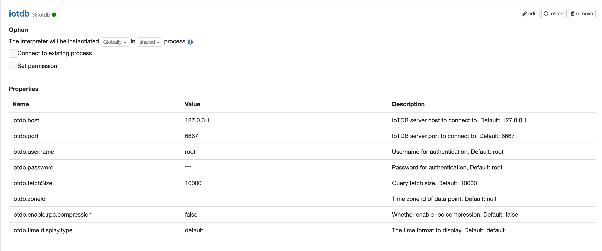
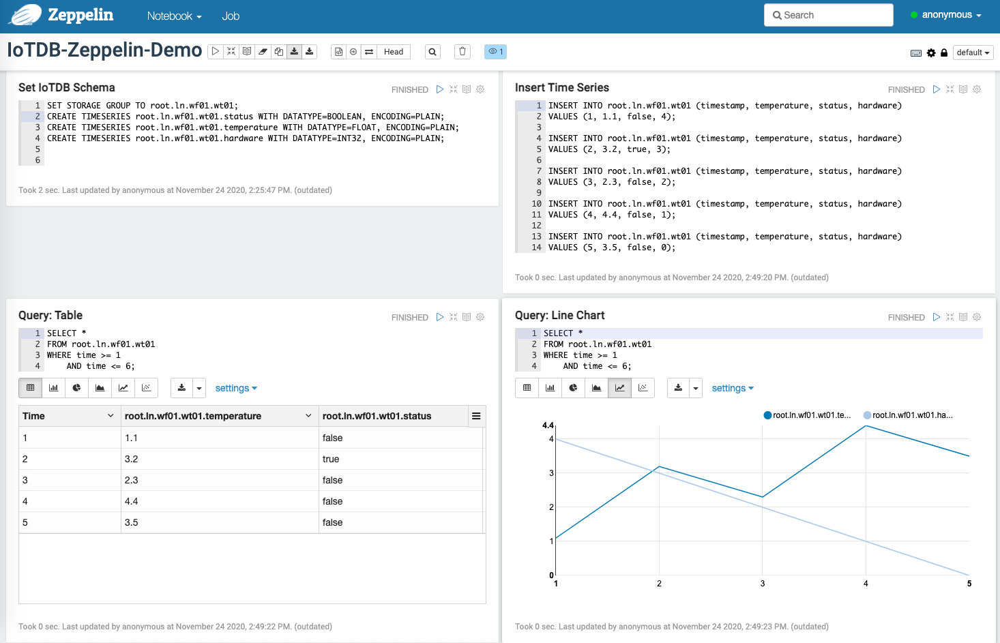

<!--
Licensed under the Apache License, Version 2.0 (the "License");
you may not use this file except in compliance with the License.
You may obtain a copy of the License at

http://www.apache.org/licenses/LICENSE-2.0

Unless required by applicable law or agreed to in writing, software
distributed under the License is distributed on an "AS IS" BASIS,
WITHOUT WARRANTIES OR CONDITIONS OF ANY KIND, either express or implied.
See the License for the specific language governing permissions and
limitations under the License.
-->


# IoTDB Interpreter for Apache Zeppelin

<div id="toc"></div>

## Overview

[Apache IoTDB](http://iotdb.apache.org/) (Database for Internet of Things) is an IoT native database with high performance for data management and analysis, deployable on the edge and the cloud. Due to its light-weight architecture, high performance and rich feature set together with its deep integration with Apache Hadoop, Spark and Flink, Apache IoTDB can meet the requirements of massive data storage, high-speed data ingestion and complex data analysis in the IoT industrial fields.


## Configuration

<table class="table-configuration">
  <tr>
    <th>Property</th>
    <th>Default</th>
    <th>Description</th>
  </tr>
  <tr>
    <td>iotdb.host</td>
    <td>127.0.0.1</td>
    <td>IoTDB server host to connect to</td>
  </tr>
  <tr>
    <td>iotdb.port</td>
    <td>6667</td>
    <td>IoTDB server port to connect to</td>
  </tr>
  <tr>
    <td>iotdb.username</td>
    <td>root</td>
    <td>Username for authentication</td>
  </tr>
  <tr>
    <td>iotdb.password</td>
    <td>root</td>
    <td>Password for authentication,</td>
  </tr>
  <tr>
    <td>iotdb.fetchSize</td>
    <td>10000</td>
    <td>Query fetch size</td>
  </tr>
  <tr>
    <td>iotdb.zoneId</td>
    <td></td>
    <td>Time zone id of data point</td>
  </tr>
  <tr>
    <td>iotdb.enable.rpc.compression</td>
    <td>false</td>
    <td>Whether enable rpc compression</td>
  </tr>
  <tr>
    <td>iotdb.time.display.type</td>
    <td>default</td>
    <td>The time format to display</td>
  </tr>
</table>
  The snapshot of configuration is as follows:

## Start IoTDB

You can install IoTDB according to [IoTDB Quick Start](http://iotdb.apache.org/UserGuide/V0.10.x/Get%20Started/QuickStart.html). Suppose that IoTDB is placed at `$IoTDB_HOME`.

Go to `$IoTDB_HOME` and [start IoTDB server](https://github.com/apache/iotdb#start-iotdb):

```shell
# Unix/OS X
> nohup sbin/start-server.sh >/dev/null 2>&1 &
or
> nohup sbin/start-server.sh -c <conf_path> -rpc_port <rpc_port> >/dev/null 2>&1 &

# Windows
> sbin\start-server.bat -c <conf_path> -rpc_port <rpc_port>
```


## Enabling the Elasticsearch Interpreter

In a notebook, to enable the **IoTDB** interpreter, click the **Gear** icon and select **IoTDB**.

## Using the IoTDB Interpreter

In a paragraph, use `%iotdb` to select the IoTDB interpreter and then input all commands. 

We provide some simple SQL to show the use of Zeppelin-IoTDB-interpreter:

```sql
SET STORAGE GROUP TO root.ln.wf01.wt01;
CREATE TIMESERIES root.ln.wf01.wt01.status WITH DATATYPE=BOOLEAN, ENCODING=PLAIN;
CREATE TIMESERIES root.ln.wf01.wt01.temperature WITH DATATYPE=FLOAT, ENCODING=PLAIN;
CREATE TIMESERIES root.ln.wf01.wt01.hardware WITH DATATYPE=INT32, ENCODING=PLAIN;

INSERT INTO root.ln.wf01.wt01 (timestamp, temperature, status, hardware)
VALUES (1, 1.1, false, 11);

INSERT INTO root.ln.wf01.wt01 (timestamp, temperature, status, hardware)
VALUES (2, 2.2, true, 22);

INSERT INTO root.ln.wf01.wt01 (timestamp, temperature, status, hardware)
VALUES (3, 3.3, false, 33);

INSERT INTO root.ln.wf01.wt01 (timestamp, temperature, status, hardware)
VALUES (4, 4.4, false, 44);

INSERT INTO root.ln.wf01.wt01 (timestamp, temperature, status, hardware)
VALUES (5, 5.5, false, 55);


SELECT *
FROM root.ln.wf01.wt01
WHERE time >= 1
	AND time <= 6;
```

A demo notebook can be found at `$Zeppelin_HOME/iotdbIoTDB-Zeppelin-Demo.zpln`. The screenshot is as follows.




