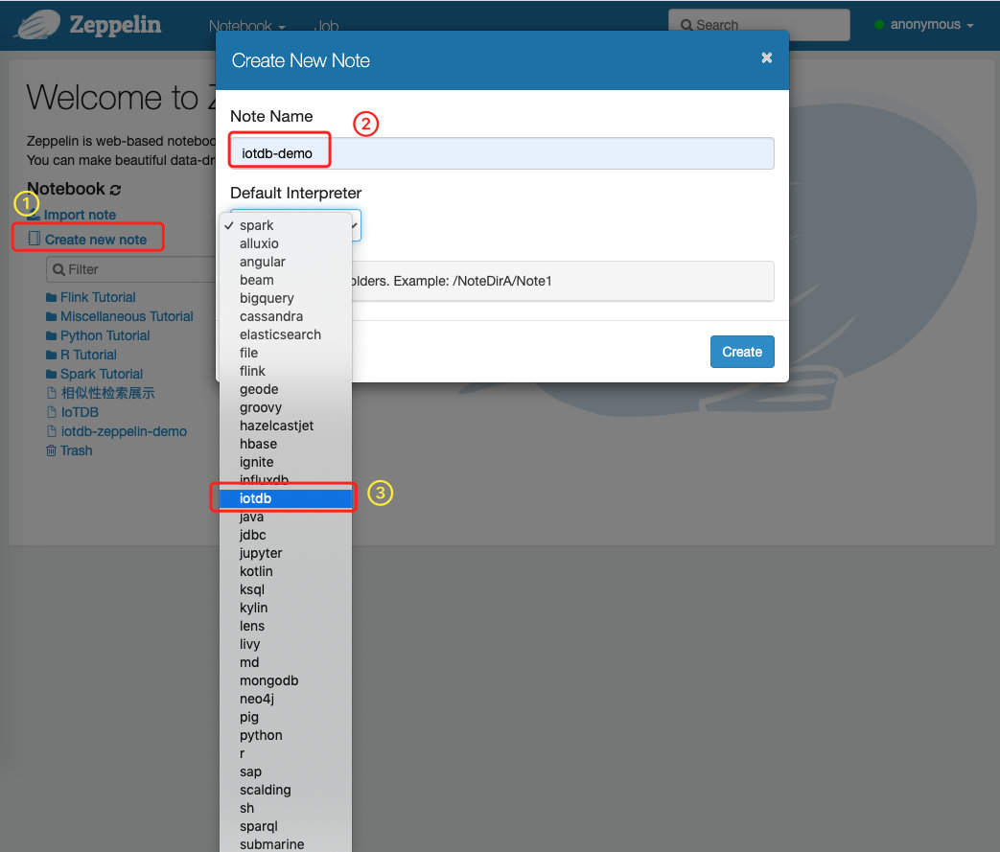

<!--

    Licensed to the Apache Software Foundation (ASF) under one
    or more contributor license agreements.  See the NOTICE file
    distributed with this work for additional information
    regarding copyright ownership.  The ASF licenses this file
    to you under the Apache License, Version 2.0 (the
    "License"); you may not use this file except in compliance
    with the License.  You may obtain a copy of the License at
    
        http://www.apache.org/licenses/LICENSE-2.0
    
    Unless required by applicable law or agreed to in writing,
    software distributed under the License is distributed on an
    "AS IS" BASIS, WITHOUT WARRANTIES OR CONDITIONS OF ANY
    KIND, either express or implied.  See the License for the
    specific language governing permissions and limitations
    under the License.

-->


# Install  IoTDB

You can install IoTDB according to [IoTDB Quick Start](http://iotdb.apache.org/UserGuide/V0.10.x/Get%20Started/QuickStart.html). Suppose that IoTDB is placed at `$IoTDB_HOME`.

# Build IoTDB-Zeppelin Interpreter

You can build and test iotdb-interpreter as follows:

```shell
# build
mvn clean package-pl iotdb -am -DskipTests

# test
mvn test -pl iotdb -am -Dtest='org.apache.zeppelin.iotdb.*' -DfailIfNoTests=false
```

# Start Zeppelin and IoTDB

Go to `$IoTDB_HOME` and [start IoTDB server](https://github.com/apache/iotdb#start-iotdb):

```shell
# Unix/OS X
> nohup sbin/start-server.sh >/dev/null 2>&1 &
or
> nohup sbin/start-server.sh -c <conf_path> -rpc_port <rpc_port> >/dev/null 2>&1 &

# Windows
> sbin\start-server.bat -c <conf_path> -rpc_port <rpc_port>
```

Go to `$Zeppelin_HOME` and start Zeppelin by running: 

```shell
 # Unix/OS X
./bin/zeppelin-daemon.sh start

# Windows
./bin/zeppelin.cmd
```

After Zeppelin has been started, visit http://localhost:8080/ , and create a new node with IoTDB interpreter.



Configure 

# Use IoTDB-Zeppelin

We provide some simple SQL to show the use of Zeppelin-IoTDB-interpreter:

```sql
SET STORAGE GROUP TO root.ln.wf01.wt01;
CREATE TIMESERIES root.ln.wf01.wt01.status WITH DATATYPE=BOOLEAN, ENCODING=PLAIN;
CREATE TIMESERIES root.ln.wf01.wt01.temperature WITH DATATYPE=FLOAT, ENCODING=PLAIN;
CREATE TIMESERIES root.ln.wf01.wt01.hardware WITH DATATYPE=INT32, ENCODING=PLAIN;

INSERT INTO root.ln.wf01.wt01 (timestamp, temperature, status, hardware)
VALUES (1, 1.1, false, 11);

INSERT INTO root.ln.wf01.wt01 (timestamp, temperature, status, hardware)
VALUES (2, 2.2, true, 22);

INSERT INTO root.ln.wf01.wt01 (timestamp, temperature, status, hardware)
VALUES (3, 3.3, false, 33);

INSERT INTO root.ln.wf01.wt01 (timestamp, temperature, status, hardware)
VALUES (4, 4.4, false, 44);

INSERT INTO root.ln.wf01.wt01 (timestamp, temperature, status, hardware)
VALUES (5, 5.5, false, 55);


SELECT *
FROM root.ln.wf01.wt01
WHERE time >= 1
	AND time <= 6;
```

The screenshot is as follows:


The above demo notebook can be found at `./IoTDB-Zeppelin-Demo.zpln`.


